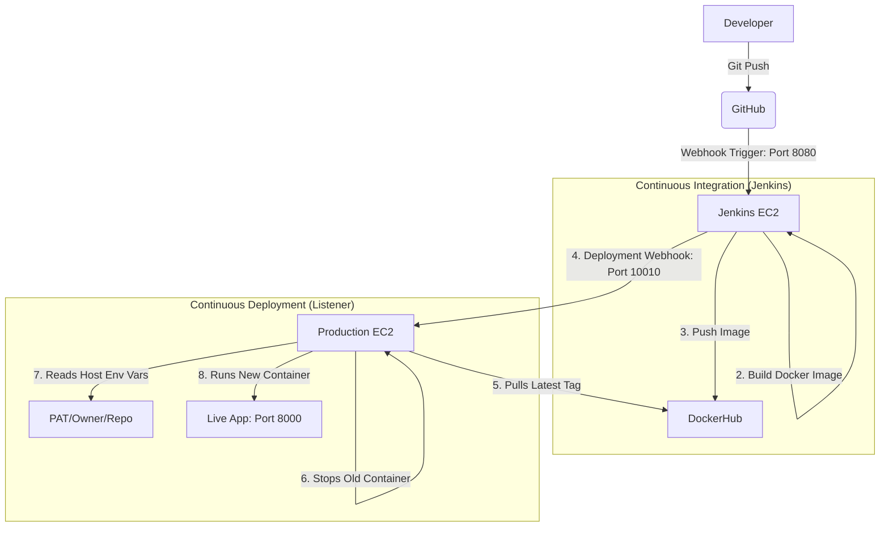

# Automated CI/CD Pipeline: Python App with Webhook Auto-Update

This repository contains a full-stack CI/CD automation suite. It automates the journey from a code commit in GitHub to a live, auto-updated deployment on an AWS EC2 instance using **Jenkins**, **Docker**, and a custom **Python Webhook Listener**.

---

##  System Architecture

The following diagram represents the end-to-end flow:



---

##  AWS Infrastructure Configuration

To ensure communication between services, update your **AWS Security Groups** with the following Inbound Rules:

| Protocol | Port  | Source                   | Description                     |
|----------|-------|--------------------------|----------------------------------|
| TCP      | 8080  | GitHub IPs or 0.0.0.0/0  | Jenkins UI & GitHub Webhook     |
| TCP      | 10010 | Jenkins Private/Public IP| Deployment Listener Webhook     |
| TCP      | 8000  | 0.0.0.0/0                | Access to the running Python App|
| TCP      | 22    | Your Admin IP            | SSH Access                      |

---

##  Environment Variables & Secrets

We follow the **Security-First** approach: secrets are never hardcoded in images or files.

### 1. On Production EC2 (Deployment Host)

The listener script reads these from the system environment. Add them to `~/.bashrc`:

```bash
export GITHUB_PAT="ghp_your_secret_token_here"
export REPO_OWNER="your-github-username"
export REPO_NAME="your-repo-name"
```

Run `source ~/.bashrc` to apply.

### 2. In Jenkins (Credentials & System)

- **Manage Jenkins > Credentials:** Add `dockerhub-password` as Secret Text.
- **Manage Jenkins > System:** Add `EC2_PUBLIC_IP` as a Global Environment Variable.

---

##  Webhook Configurations

### 1. GitHub to Jenkins (Trigger Build)

| Setting       | Value                                      |
|---------------|--------------------------------------------|
| URL           | `http://<JENKINS_IP>:8080/github-webhook/` |
| Content-Type  | `application/json`                         |
| Events        | `push`                                     |

### 2. Jenkins to EC2 (Trigger Deploy)

- Handled by the Pipeline via `curl` to `http://<EC2_IP>:10010`.
- Sends a JSON payload: `{"image": "...", "tag": "..."}`.

---

##  Execution: The Deployment Listener

The `deploy_listner.py` must be running on your production EC2 to receive the "nudge" from Jenkins.

### Install Dependencies

```bash
python3 -m pip install flask
```

### Start the Listener

**Foreground (for testing):**

```bash
python3 deploy_listner.py
```

**Background (for production):**

```bash
nohup python3 deploy_listner.py > listener.log 2>&1 &
```

### Verify Listener is Running

```bash
# Check if the process is running
ps aux | grep deploy_listner

# Check the listener logs
tail -f listener.log

# Test the listener endpoint
curl -X POST http://localhost:10010 -H "Content-Type: application/json" -d '{"image": "test", "tag": "latest"}'
```

### Stop the Listener

```bash
# Find the process ID
ps aux | grep deploy_listner

# Kill the process
kill <PID>

# Or kill by port
sudo fuser -k 10010/tcp
```

---

## 🛠 Troubleshooting

| Issue | Solution |
|-------|----------|
| **Port 8000 Error** | If the listener fails with "Port already allocated," run `sudo fuser -k 8000/tcp` to manually clear the port. |
| **Port 10010 Error** | Clear the listener port with `sudo fuser -k 10010/tcp` and restart the listener. |
| **400 Error** | Ensure the JSON keys in the Jenkins `curl` command match the `data.get()` keys in the Python script. |
| **Webhook Timeout** | Check AWS Security Group port 10010 is open for Jenkins IP. |
| **Listener Not Running** | Check with `ps aux \| grep deploy_listner` and restart if needed. |
| **Environment Variables Not Set** | Run `source ~/.bashrc` or log out and log back in. Verify with `echo $GITHUB_PAT`. |

---

##  Quick Reference Commands

```bash
# Start listener in background
nohup python3 deploy_listner.py > listener.log 2>&1 &

# View listener logs
tail -f listener.log

# Check running processes
ps aux | grep deploy_listner

# Kill listener process
kill $(pgrep -f deploy_listner.py)

# Clear port 8000
sudo fuser -k 8000/tcp

# Clear port 10010
sudo fuser -k 10010/tcp

# Reload environment variables
source ~/.bashrc

# Check Docker containers
docker ps -a

# View Docker logs
docker logs <container_id>
```

---

##  Project Structure

```
.
├── deploy_listner.py      # Webhook listener for auto-deployment
├── Jenkinsfile            # CI/CD pipeline definition
├── Dockerfile             # Container build instructions
├── app.py                 # Main Python application
├── requirements.txt       # Python dependencies
└── README.md              # This file
```

---

##  CI/CD Flow Summary

1. **Developer** pushes code to GitHub
2. **GitHub Webhook** triggers Jenkins build (Port 8080)
3. **Jenkins** builds Docker image with commit ID as tag
4. **Jenkins** pushes image to DockerHub
5. **Jenkins** sends webhook to Production EC2 (Port 10010)
6. **Listener** pulls the new image from DockerHub
7. **Listener** stops the old container
8. **Listener** starts new container with latest image (Port 8000)
9. **App** is live and accessible!

---

## 📝 License

This project is licensed under the MIT License.
